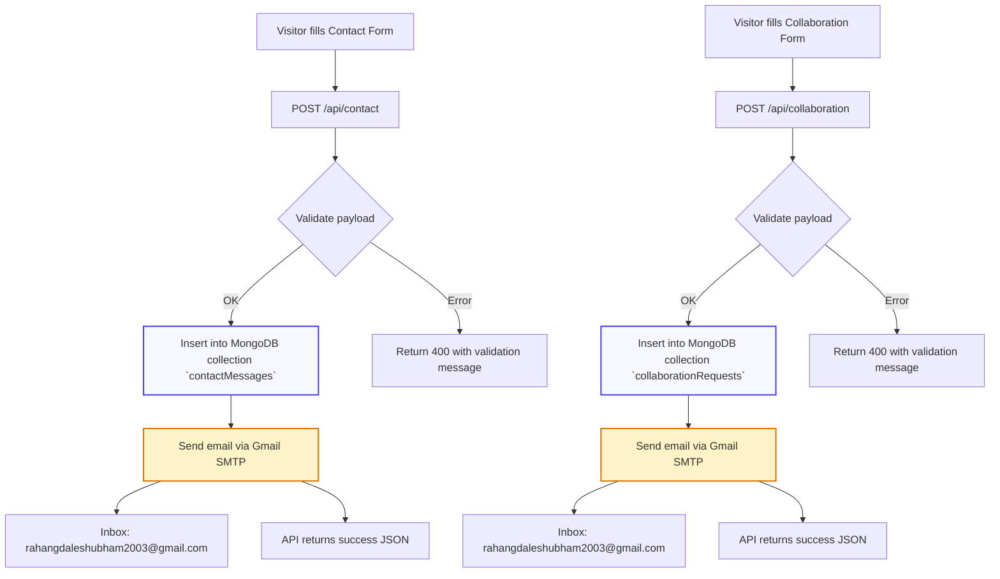

# Perfionix AI Website

A modern marketing website for Perfionix AI, showcasing services, industry solutions, team expertise, and partnership opportunities. Built with **Next.js 14**, **React 18**, **Tailwind CSS**, and **Framer Motion**, the site delivers a polished, animated experience with performance-focused optimizations, Gmail SMTP-powered notifications, and MongoDB-backed contact and collaboration workflows.

## 🆕 Latest Updates (October 2025)
- **Gmail SMTP integration** using account `programmershubham775@gmail.com` (sender `shubhamaisolutions@gmail.com`) with app-password based authentication.
- **MongoDB Atlas persistence** for both Contact and Collaboration forms via collections `contactMessages` and `collaborationRequests` in database `perfionix`.
- **Shared database helper** at `lib/mongodb.ts` to reuse a single client across API routes.
- **README refresh** detailing environment variables, credential management, and database inspection steps.

## 🚀 Features
- **Immersive Hero** with gradient accents, responsive CTAs, and instant-render animations
- **Industry and Services sections** highlighting cross-domain AI solutions
- **Interactive collaboration workflow** featuring a dedicated page, MongoDB persistence, and email notifications
- **Enhanced chat assistant widget** with dynamic gradients, status indicator, and dark mode layout
- **Modern contact section** with social cards and embedded Google Maps location for Tiroda, Maharashtra
- **Performance tuning** (lazy-loaded media, reduced animation delays, `content-visibility`, `contain` usage)
- **Responsive navigation** and deep-linked CTAs pointing to `/industries`, `/contact`, and `/collaboration`

## 🧱 Tech Stack
- [Next.js 14](https://nextjs.org/) (App Router)
- [React 18](https://react.dev/)
- [Tailwind CSS 3](https://tailwindcss.com/)
- [Framer Motion](https://www.framer.com/motion/)
- [Lucide Icons](https://lucide.dev/)
- [Nodemailer](https://nodemailer.com/) for contact + collaboration form email delivery
- [MongoDB Atlas](https://www.mongodb.com/atlas/database) for persisting submissions

## 📂 Project Structure
```
perfionix-ai-website/
├── app/
│   ├── page.tsx                # Home page
│   ├── contact/                # Contact hero, info, and form
│   ├── collaboration/          # Collaboration hero + advanced form
│   ├── industries/             # Industry-specific solutions
│   ├── services/               # Services overview
│   ├── team/                   # Team showcase
│   ├── about/                  # About Perfionix AI
│   └── api/
│       └── collaboration/      # POST route → MongoDB + Nodemailer handler
│       └── contact/            # POST route → MongoDB + Nodemailer handler
├── lib/
│   └── mongodb.ts              # Reusable MongoDB client helper
├── components/                 # Hero, ChatWidget, forms, cards, etc.
├── public/                     # Static assets (logo, media)
├── tailwind.config.js          # Tailwind theme configuration
├── app/globals.css             # Global styles
├── package.json                # Scripts and dependencies
└── README.md                   # Project documentation (this file)
```

## ⚙️ Getting Started
1. **Install dependencies**
   ```bash
   npm install
   ```
2. **Configure environment variables**
   Create or update `.env.local` in the project root:
   ```env
   # Gmail SMTP (account: shubhamaisolutions@gmail.com)
   SMTP_HOST=smtp.gmail.com
   SMTP_PORT=587
   SMTP_USER=shubhamaisolutions@gmail.com
   SMTP_PASS=<your_gmail_app_password>
   SMTP_FROM="Perfionix AI <shubhamaisolutions@gmail.com>"
   COLLABORATION_EMAIL_TO=rahangdaleshubham2003@gmail.com

   # MongoDB Atlas connection
   MONGODB_URI=mongodb+srv://programmershubham755_db_user:<password>@cluster0.mtffd3s.mongodb.net/?retryWrites=true&w=majority&appName=Cluster0
   ```
   - Generate an app password under **Google Account → Security → App Passwords** and replace `<your_gmail_app_password>`.
   - Replace `<password>` with the actual database user password (`CdatzQol7wDUs6Nn`) or provision a new credential.
   - Ensure `.env.local` stays out of version control.
3. **Run the development server**
   ```bash
   npm run dev

   npm run dev -- --hostname 0.0.0.0
   
   ```
   Visit `http://localhost:3000` in your browser.

## 📬 Form Workflows & Storage

- **Collaboration Form** (`components/CollaborationForm.tsx`)
  - Submits to `POST /api/collaboration`
  - Validates required fields, stores the payload in MongoDB collection `collaborationRequests`, then sends an email notification
  - Default recipient: `rahangdaleshubham2003@gmail.com` (override via `COLLABORATION_EMAIL_TO`)

- **Contact Form** (`components/ContactForm.tsx`)
  - Submits to `POST /api/contact`
  - Validates inputs, persists the message to MongoDB collection `contactMessages`, and emails the configured inbox
  - Response shows inline success/error feedback to the user

Both routes rely on `lib/mongodb.ts` for a shared Atlas connection. Emails are dispatched through Gmail SMTP (account: `programmershubham775@gmail.com` / sender `shubhamaisolutions@gmail.com`).

## 📊 Form Flow Diagram



## 🌐 Key Pages & Links
- `/` – Landing page highlighting offerings and CTAs
- `/industries` – Sector-specific AI solutions
- `/services` – Consulting and product services overview
- `/collaboration` – Partnership pitch form and value proposition
- `/contact` – Contact details, map embed, and general inquiry form

## 🔧 Available Scripts
- `npm run dev` – Start the Next.js development server
- `npm run build` – Generate a production build
- `npm run start` – Serve the production build
- `npm run lint` – Run ESLint checks

## 🧠 Performance Notes
- Video background is lazy-loaded with reduced opacity for faster initial paints.
- Animations use shortened durations and delays for instant render feel.
- `content-visibility` and `contain` used to reduce layout cost.
- Chat widget loads dynamically with a sleek gradient UI and loading indicators.

## 📞 Contact
- **Email:** perfionixaisolutions@gmail.com
- **Phone:** +91 6261330148
- **Headquarters:** Tiroda, Maharashtra 441714, India
- **LinkedIn:** https://www.linkedin.com/company/perfionix-ai-solutions
- **Instagram:** https://www.instagram.com/perfionix_ai.io

## ✅ Next Steps
- Replace placeholder secrets with secure values before deployment.
- Deploy to a hosting provider (e.g., Vercel) and configure all environment variables (SMTP + MongoDB) in project settings.
- Monitor MongoDB collections via Atlas and rotate credentials as necessary.
- Keep Gmail app passwords private; regenerate if you suspect exposure.

## 🗄️ Database Operations

- **Database used:** MongoDB Atlas cluster `Cluster0`, database name `perfionix`.

- **Check stored submissions via mongosh**
  ```bash
  # Connect using MongoDB Shell or mongosh
  mongosh "mongodb+srv://programmershubham755_db_user:<password>@cluster0.mtffd3s.mongodb.net/perfionix"

  # Inside the shell
  show collections
  db.collaborationRequests.find().sort({ createdAt: -1 }).limit(5)
  db.contactMessages.find().sort({ createdAt: -1 }).limit(5)
  ```
- Replace `<password>` with `CdatzQol7wDUs6Nn` (or the rotated value).
- Alternatively use MongoDB Atlas UI → **Cluster0 → Browse Collections** to inspect `perfionix` database.
- Atlas UI quick path: `https://cloud.mongodb.com` → log in with account `programmershubham775@gmail.com` → select project → **Data Services → Cluster0 → Browse Collections**.

## 🔐 Account & Security Notes

- **Gmail SMTP account:** `programmershubham775@gmail.com`
  - Sender identity: `shubhamaisolutions@gmail.com` (set in `SMTP_FROM`)
  - Use Google App Passwords; do **not** enable “Less secure apps”.
- **MongoDB Atlas project:** Cluster `Cluster0`
  - Database user: `programmershubham755_db_user`
  - Default password: `CdatzQol7wDUs6Nn` (rotate in Atlas UI if compromised)
- Store new credentials in a secure vault; never commit them to Git.

> Built with passion to showcase Perfionix AI's innovation across industries.
